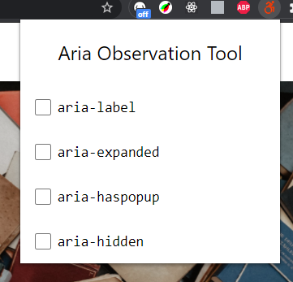
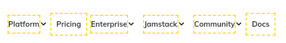

# ARIA Observation Tool Extension

Herramienta como extensión del navegador para observar si en las etiquetas HTML están aplicados los atributos "ARIA".

Si no están aplicados serán remarcados con un color en los bordes.

Ejemplo:
